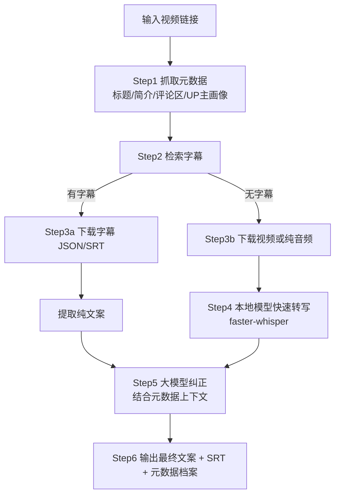
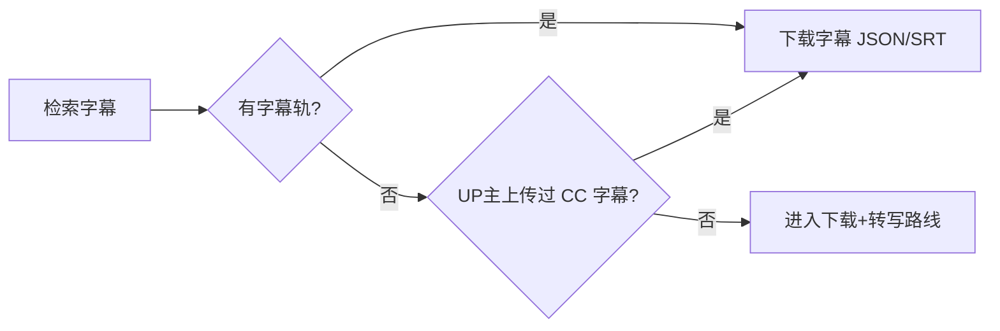

# 视频文案提取完整方案（字幕优先 → 下载兜底 → 本地转写 → 大模型纠正）

> 目标：给定一个视频链接（B站/抖音/YouTube 等），产出**准确、可用的文案**。
> 核心思路：**能拿字幕就不下载**；下载时**连带元数据**（标题/简介/评论/UP画像）；
> 用**本地模型快速转写**；最后用**大模型结合视频信息纠正**成稿。
> 整理日期：2026-08-07 ｜ 环境：Windows + yt-dlp + you-get + ffmpeg + faster-whisper

---

## 一、完整链路（六步）



**优先级原则**：
1. 字幕 > 转写：字幕零误差，转写只是兜底
2. 元数据在**下载前**就抓：标题/简介/评论/UP画像本身就是文案纠错和整理的"参考答案"
3. 先本地快转写、后大模型纠正：本地模型省钱快、大模型只做精修，成本最低

---

## 二、Step 1：元数据采集

### 要采集什么

| 字段 | 用途 |
|------|------|
| **标题** | 判断主题、纠正专有名词 |
| **简介 (desc)** | 作者自述、关键词、时间点 |
| **评论区精选** | 常见错别字对照、补充背景、观众解读 |
| **UP主画像**（昵称/签名/粉丝/投稿分类） | 判断领域术语、风格、口癖 |
| 标签/分区/发布时间 | 语境补充 |

### 方式 A：yt-dlp（推荐，一步到位）

```powershell
# 只抓元数据不下载视频（info.json 含标题/简介/UP主/标签/点赞评论数）
yt-dlp --write-info-json --write-description --write-comments --skip-download "URL"

# 文件说明
# *.info.json   ← 标题、uploader、tags、like_count 等全量元数据
# *.description ← 简介
# *.comments.json ← 评论区（--write-comments 时生成）
```

### 方式 B：B站官方接口（脚本化用）

```powershell
# 1) 视频信息（标题/简介/UP主mid/cid/点赞评论数）
Invoke-RestMethod "https://api.bilibili.com/x/web-interface/view?bvid=BVxxxx"

# 2) UP主画像
Invoke-RestMethod "https://api.bilibili.com/x/space/wbi/acc/info?mid={mid}"

# 3) UP主投稿列表（画像：他常发什么类型）
Invoke-RestMethod "https://api.bilibili.com/x/space/wbi/arc/search?mid={mid}"

# 4) 评论区（oid = aid）
Invoke-RestMethod "https://api.bilibili.com/x/v2/reply?type=1&oid={aid}&sort=2"
```

> 注：B站 wbi 系接口需要 wbi 签名参数，日常使用**优先 yt-dlp**，API 适合写脚本批量跑。

---

## 三、Step 2：字幕检索（优先路线）

### 方式 A：yt-dlp 列出并下载字幕

```powershell
# 列出可用字幕
yt-dlp --list-subs "URL"

# 只下载中文字幕，不下载视频
yt-dlp --write-subs --sub-langs "zh.*,zh-Hans,zh-CN" --skip-download "URL"
```

### 方式 B：B站字幕接口（B站视频字幕其实是 JSON）

```powershell
# 1) 先拿 cid
$v = Invoke-RestMethod "https://api.bilibili.com/x/web-interface/view?bvid=BVxxxx"
$cid = $v.data.cid

# 2) 再查字幕列表（data.subtitle.subtitles[]，含 subtitle_url）
$p = Invoke-RestMethod "https://api.bilibili.com/x/player/wbi/v2?bvid=BVxxxx&cid=$cid"

# 3) 下载字幕 JSON（url 前要补 https:），body[] 每条含 from/to/content
#    → 转成 SRT 或直接抽 content 拼纯文案
```

### 判定逻辑



---

## 四、Step 3：视频下载（字幕拿不到时的兜底）

```powershell
# 完整视频（画质优先）
yt-dlp -f "bv*+ba/b" -o "videos/%(title)s.%(ext)s" "URL"

# 只要音频（转写只需音频，体积小 90%，速度快）
yt-dlp -f "ba/b" -x --audio-format mp3 -o "audio/%(title)s.%(ext)s" "URL"

# 备用：you-get（某些站 yt-dlp 失效时）
you-get -o videos "URL"
```

**下载时必须同步做的事**：
- ✅ 标题已含在文件名 `%(title)s`
- ✅ 元数据用 `--write-info-json --write-description --write-comments` 一并落盘
- ✅ 高清大文件可先下低码率试转写，确认可用再下原画

---

## 五、Step 4：本地模型快速转写（faster-whisper，本机已装）

```python
from faster_whisper import WhisperModel

model = WhisperModel("small", device="cpu", compute_type="int8")
segments, info = model.transcribe(
    "audio.mp3",                 # 建议输入纯音频，省时省内存
    language="zh",
    vad_filter=True,             # 滤静音
    initial_prompt="以下是普通话视频内容。",
)
for seg in segments:
    print(f"[{seg.start:.1f}s -> {seg.end:.1f}s] {seg.text.strip()}")
```

| 模型 | 速度 | 精度 | 适用 |
|------|------|------|------|
| tiny/base | 快 | 一般 | 粗转/预览 |
| **small** | 中 | 好 | 日常推荐 |
| medium | 慢 | 更好 | 口播/正式内容 |
| large-v3 | 很慢 | 最好 | 高质量要求 |

**提速技巧**：只转音频（`-x`）、`int8`、`vad_filter`、超长视频分段转写。

---

## 六、Step 5：大模型纠正（结合视频信息，产出最终文案）

### 为什么需要这一步
本地 ASR 转写存在：无标点、口语词多、专有名词/品牌/人名易错、句子粘连。
而**标题/简介/评论/UP画像恰好提供了纠错所需的参考答案**——这是整套方案的关键。

### Prompt 模板

```text
你是视频文案整理专家。请根据【视频元数据】和【原始转写稿】，输出纠正后的完整文案。

要求：
1. 专有名词、品牌名、人名、术语以元数据为准修正
2. 删除口语填充词（嗯/啊/就是/然后等）
3. 补充标点、正确断句
4. 按视频结构分段（开头引入 / 正文 / 结尾总结）
5. 输出 Markdown，保留关键数字和观点

【视频元数据】
标题：{title}
简介：{description}
标签：{tags}
评论区精选：{top_comments}
UP主画像：{uploader_info}

【原始转写稿】
{raw_transcript}
```

### 模型选型

| 场景 | 选择 |
|------|------|
| 本地离线 | Ollama（qwen2.5 7B 等） |
| 云端 | DeepSeek / Qwen / OpenAI 等 API |
| 批量低成本 | 只纠错不改写，用最小可用模型 |

---

## 七、Step 6：输出规范

```
outputs/{视频标题}/
├── 最终文案.md          # 大模型纠正后的成品
├── 原始转写.srt         # 带时间轴字幕
├── 原始转写.txt         # ASR 原始文本
└── 元数据.json          # 标题/简介/评论/UP画像 存档
```

- 统一 UTF-8（无 BOM）
- 元数据 JSON 保留原始字段，便于追溯和复用

---

## 八、本机工具现状（2026-08-07 实测）

| 组件 | 状态 | 用途 |
|------|------|------|
| yt-dlp | ✅ 已装 | 元数据/字幕/下载 主力 |
| you-get | ✅ 已装 | 备用下载 |
| ffmpeg / ffprobe | ✅ 已装 | 音频提取/格式转换 |
| faster-whisper | ✅ 已装 | 本地快速转写 |
| Ollama / 大模型 API | ❓ 待确认 | 最后纠正环节 |

---

## 九、常见问题

- **抖音视频**：yt-dlp 支持，但字幕接口不稳定，多半走"下载+转写"路线
- **B站无字幕且画外音是音乐/无人声**：转写为空属正常，可结合简介/评论区人工补
- **口音重**：转写差时换 FunASR，或在大模型纠正环节结合评论区人工信息修正
- **评论区获取失败**：`--write-comments` 需登录 cookie（`--cookies-from-browser edge`）
- **隐私**：本地转写不上传；元数据/评论如涉隐私，落盘后注意管理
